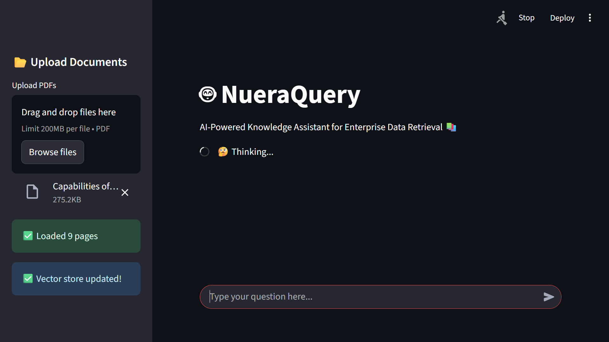
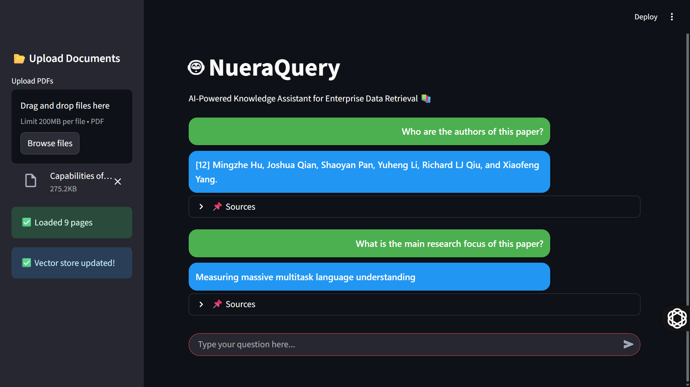
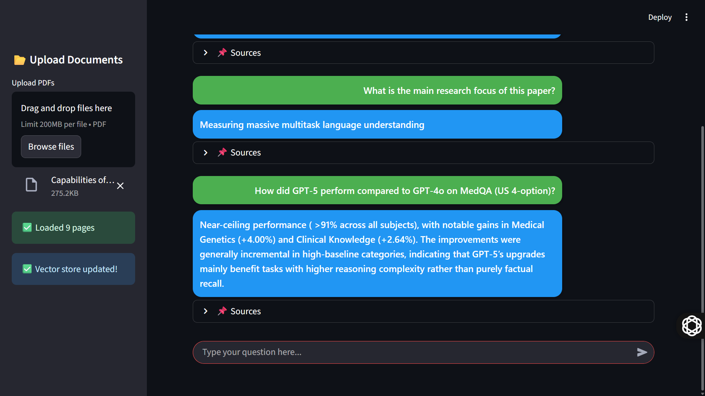

# 🤖 NueraQuery  

NueraQuery is an **AI-powered Document Question-Answering System** that transforms static files (PDF, DOCX, TXT, etc.) into an **interactive knowledge base**.  
Users can upload documents, ask natural language questions, and instantly get context-aware answers.  

---

## 🔴 Problem  

Professionals, researchers, and students often deal with **long and complex documents** such as reports, legal files, and academic papers.  

- Reading hundreds of pages just to extract a few details is **time-consuming and inefficient**.  
- Manual keyword search often **misses context and semantic meaning**.  
- Information retrieval from unstructured documents becomes a **major bottleneck**.  

---

## 🟢 Solution  

**NueraQuery** solves this by combining **LLMs + Vector Search** to provide **fast, accurate, and semantic answers** directly from uploaded documents.  

✨ Core Features:  
- Upload and analyze multiple file types (PDF, DOCX, TXT).  
- Convert documents into **vector embeddings** for semantic search.  
- Ask questions in **natural language** and get context-aware responses.  
- **Chat-style interface** with clear distinction between user and AI messages.  
- Built using **Python, Streamlit, LangChain, and ChromaDB**.  

---

## 🏗 Architecture  

**Workflow Overview:**  

User <--> Streamlit UI <--> QA Chain <--> Vector Store (ChromaDB) <--> Document Embeddings


1. **Streamlit Frontend** – Chat-based UI for file uploads and QA interaction.  
2. **Document Loader & Splitter** – Breaks large docs into chunks for efficient embedding.  
3. **Vector Store (ChromaDB/FAISS)** – Stores embeddings and retrieves relevant chunks.  
4. **QA Chain (LangChain + LLM)** – Uses retrieval-augmented generation (RAG) for answers.  
5. **Optional Local Cache** – Saves embeddings for faster re-queries.  

🛠 **Tech Stack:**  
- **Python 3.10+**  
- **Streamlit** – Web-based UI  
- **LangChain** – LLM orchestration  
- **ChromaDB** – Vector database  
- **OpenAI GPT** – Core LLM for answers  
- **PyPDF2 / python-docx / textract** – Document parsing  

---

## 📊 Results  

- ⚡ Queries across **multi-page PDFs answered within seconds**.  
- 🎯 **High accuracy** on semantic queries (context-aware, not just keywords).  
- 📚 Handles **reports, research papers, and company profiles** seamlessly.  
- 🚀 Portfolio-ready project that demonstrates **real-world NLP application**.  

---

## 🤖 Demo Screenshots

1. **Landing Page – File Upload Interface**  
   

2. **Chat Interface – Q&A Flow**  
   

3. **Example Query – Summarization**  
   

---

## ⚡ Setup & Installation  

```bash
# Clone the repository
git clone https://github.com/therealabhi-sr/NueraQuery.git
cd NueraQuery

# Create virtual environment
python -m venv .venv
source .venv/bin/activate   # Mac/Linux
.venv\Scripts\activate      # Windows

# Install dependencies
pip install -r requirements.txt

# Set API Key
export OPENAI_API_KEY="your_api_key_here"   # Mac/Linux
setx OPENAI_API_KEY "your_api_key_here"     # Windows

# Run the app
streamlit run app.py
